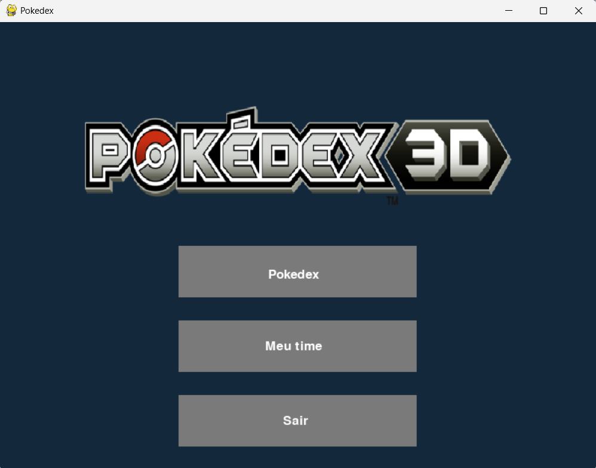
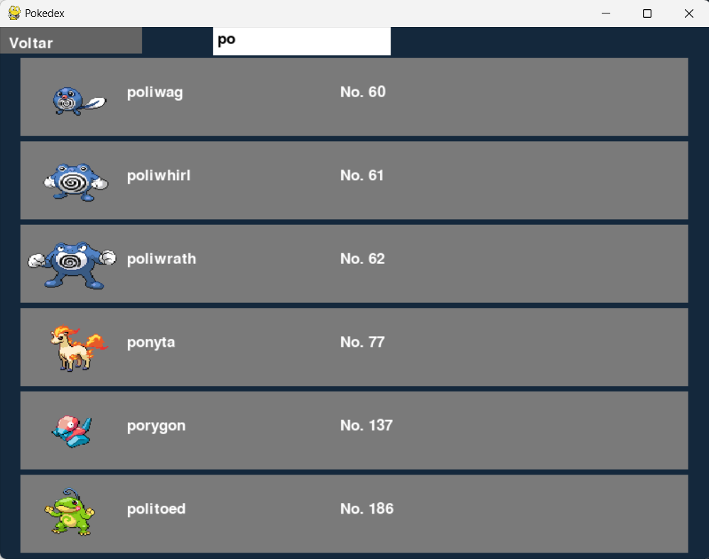
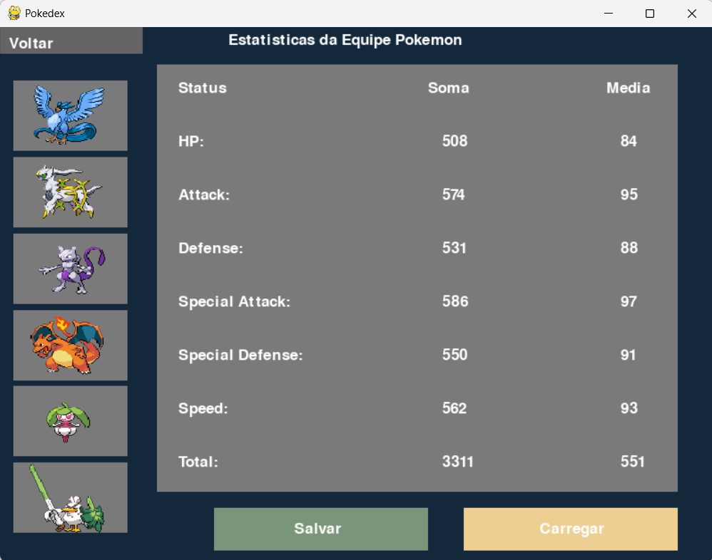
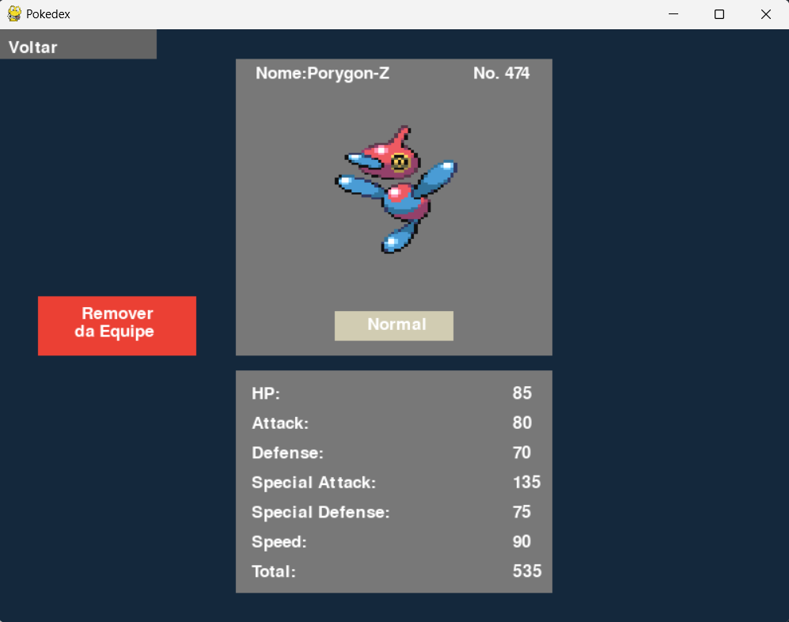
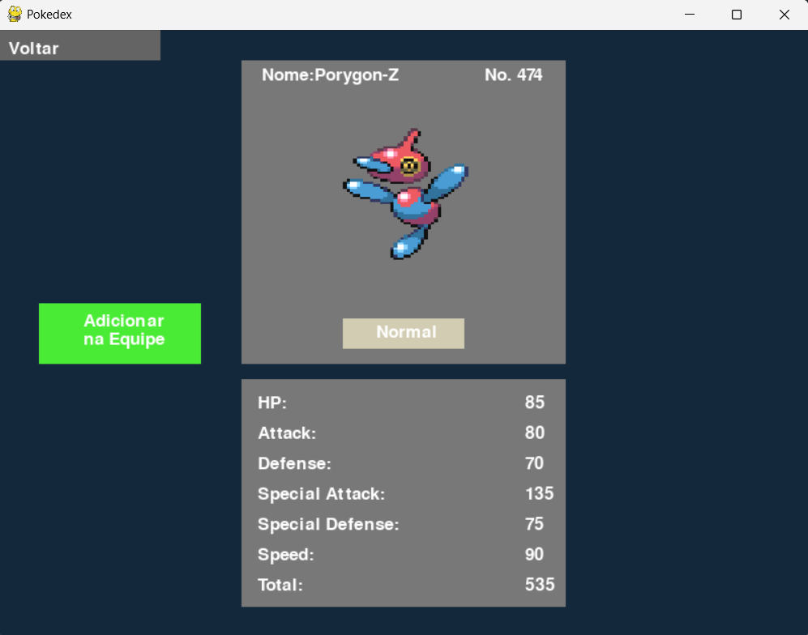

# 📘 Pokédex C++/Python

Trabalho final da disciplina de Linguagens de Programação (UFRJ), consistindo em um programa em C++ com integração ao Python para leitura e exibição de dados de uma Pokédex da 9ª geração.

---

##  Exemplos de Interface

Abaixo, algumas capturas de tela do funcionamento da Pokédex e do gerenciamento de equipe no programa:

### Menu Inicial



---

### Exemplo de Filtro de Pokémon

Busca por nome parcial ou completo com atualização enquanto digita:




---

### Gestão de Equipe

Estado inicial da equipe:


Equipe montada com até 6 Pokémon:



---

### Status de um Pokémon

Visualização de um Pokémon **dentro** e **fora** da equipe:

- Dentro da equipe:  


- Fora da equipe:  


## Como Usar o Programa

### ✅ Requisitos

Certifique-se de que os seguintes itens estão instalados no sistema:

- `g++` (compilador C++)
- `make`
- `Python 3.11` (ou ajuste no `Makefile` caso tenha versão diferente)
- Bibliotecas Python:
  - `pygame`
  - `pandas`

Você pode instalar as bibliotecas com:

```bash
pip install pygame pandas
```

Para compilar o programa com:
```bash
make
```

Para executar o programa com:
```bash
./Pokedex-V1
```
